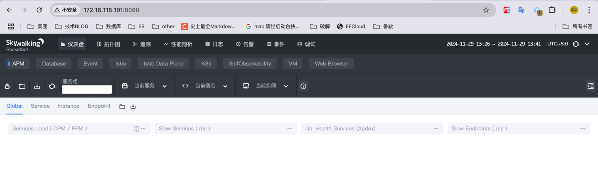
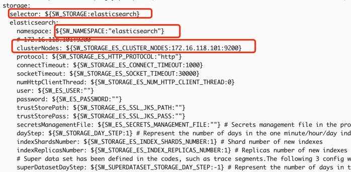
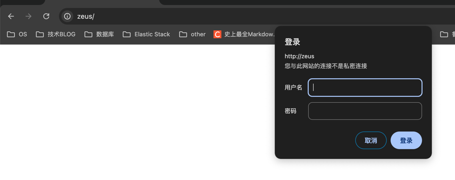
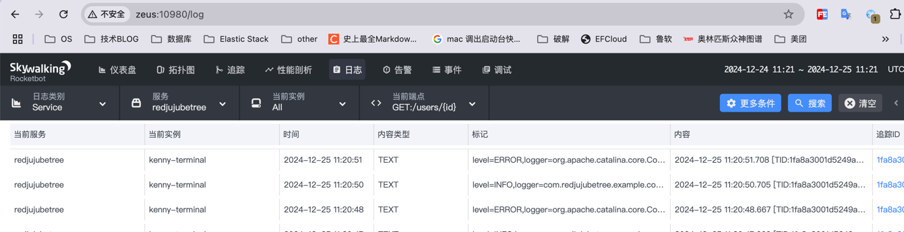
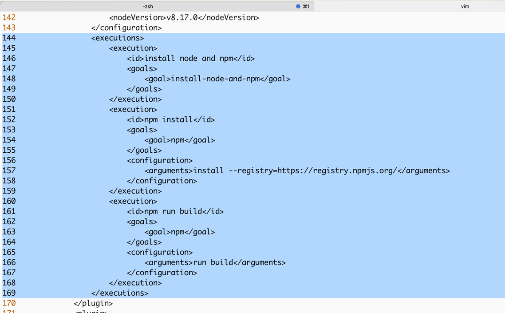

# skywalking
## 安装

安装服务器： 172.16.118.101

JDK 信息

	[root@localhost logs]# java -version
	openjdk version "1.8.0_312"
	OpenJDK Runtime Environment (build 1.8.0_312-b07)
	OpenJDK 64-Bit Server VM (build 25.312-b07, mixed mode)

下载安装包： /home/kenny/Downloads/apache-skywalking-apm-8.9.1.tar.gz

安装位置：/usr/local/skywalking/apache-skywalking-apm-bin

cd /usr/local/skywalking/apache-skywalking-apm-bin/bin

启动日志收集服务：sh oapService.sh
启动不会有日志输出，需要到日志目录查看相关的日志输出情况

	[root@localhost ~]# cd /usr/local/skywalking/apache-skywalking-apm-bin/logs/
	[root@localhost logs]# ls
	oap.log  skywalking-oap-server.log  webapp-console.log

启动UI服务： sh webappService.sh



默认端口比较容易和其他端口冲突，编辑 `webapp.yml` 修改端口

	[root@localhost skywalking]# vim apache-skywalking-apm-bin/webapp/webapp.yml

	server:
	  port: 12900

修改好文件后，停掉原来的服务，重新启动，访问 `http://172.16.118.101:12900/`

修改使用 es 存储数据



# Agent
## IDEA
VM options 添加代理参数
	
	-javaagent:/Users/kenny/skywalking/skywalking-agent/skywalking-agent.jar

Environment variables

	SW_AGENT_COLLECTOR_BACKEND_SERVICES=172.16.118.101:11800;SW_AGENT_NAME=redjujubetree

默认情况下，ThreadPool 是不会被代理，无法获取 traceId 的相关的信息，开启此功能需要将 bootstrap-plugins apm-jdk-threadpool-plugin.jar 拷贝到 plugins 目录下来开启此功能

# logback
```xml
<?xml version="1.0" encoding="UTF-8"?>

<configuration>

    <!-- 引入 Spring Boot 默认的 logback XML 配置文件  -->
    <include resource="org/springframework/boot/logging/logback/defaults.xml"/>

    <!-- 控制台 Appender -->
    <property name="CONSOLE_LOG_PATTERN" value="%clr(%d{${LOG_DATEFORMAT_PATTERN:-yyyy-MM-dd HH:mm:ss.SSS}}){faint} %clr(${LOG_LEVEL_PATTERN:-%5p}) %clr(${PID:- }){magenta} %tid %clr(---){faint} %clr([%15.15t]){faint} %clr(%-40.40logger{39}){cyan} %clr(:){faint} %m%n${LOG_EXCEPTION_CONVERSION_WORD:-%wEx}"/>
    <appender name="console" class="ch.qos.logback.core.ConsoleAppender">
        <!-- 日志的格式化 -->
        <encoder class="ch.qos.logback.core.encoder.LayoutWrappingEncoder">
            <layout class="org.apache.skywalking.apm.toolkit.log.logback.v1.x.TraceIdPatternLogbackLayout">
                <Pattern>${CONSOLE_LOG_PATTERN}</Pattern>
            </layout>
        </encoder>
    </appender>

    <!-- 从 Spring Boot 配置文件中，读取 spring.application.name 应用名 -->
    <springProperty name="applicationName" scope="context" source="spring.application.name" />
    <property name="FILE_LOG_PATTERN" value="%d{${LOG_DATEFORMAT_PATTERN:-yyyy-MM-dd HH:mm:ss.SSS}} ${LOG_LEVEL_PATTERN:-%5p} ${PID:- } %tid --- [%t] %-40.40logger{39} : %m%n${LOG_EXCEPTION_CONVERSION_WORD:-%wEx}"/>
    <!-- 日志文件的路径 -->
    <property name="LOG_FILE" value="/Users/kenny/IdeaProjects/example/logs/${applicationName}.log"/>
    <!-- 日志文件 Appender -->
    <appender name="file" class="ch.qos.logback.core.rolling.RollingFileAppender">
        <file>${LOG_FILE}</file>
        <!--滚动策略，基于时间 + 大小的分包策略 -->
        <rollingPolicy class="ch.qos.logback.core.rolling.SizeAndTimeBasedRollingPolicy">
            <fileNamePattern>${LOG_FILE}.%d{yyyy-MM-dd}.%i.gz</fileNamePattern>
            <maxHistory>7</maxHistory>
            <maxFileSize>10MB</maxFileSize>
        </rollingPolicy>
        <!-- 日志的格式化 -->
        <encoder class="ch.qos.logback.core.encoder.LayoutWrappingEncoder">
            <layout class="org.apache.skywalking.apm.toolkit.log.logback.v1.x.TraceIdPatternLogbackLayout">
                <Pattern>${FILE_LOG_PATTERN}</Pattern>
            </layout>
        </encoder>
    </appender>

    <!-- 设置 Appender -->
    <root level="INFO">
        <appender-ref ref="console"/>
        <appender-ref ref="file"/>
    </root>

</configuration>
```

# 添加用户名和密码

## 安装 htpasswd 工具
centos 
```shell
sudo yum install httpd-tools
```

## 生成密码文件
```shell
htpasswd -c /etc/nginx/.htpasswd skywalking
```
若需要为已有文件添加新用户：
```bash
htpasswd /etc/nginx/.htpasswd another_user
```

## 修改 Nginx 配置
```conf
server {
    listen       80;
    server_name  localhost;

    #配置全局密码， 如果需要部分访问需要密码，可以将一下两个配置放在指定的location 映射之下
    auth_basic  "enter the username and password";
    auth_basic_user_file  /usr/local/nginx/password;

	location / {
	    proxy_pass http://127.0.0.1:12900;
	    proxy_set_header Host $host;
            proxy_set_header X-Real-IP $remote_addr;
            proxy_set_header X-Forwarded-For $proxy_add_x_forwarded_for;
	}
    
    }
```


# 配置告警
## 使用skywalking 上报日志信息
```shell
    <appender name="grpc-log" class="org.apache.skywalking.apm.toolkit.log.logback.v1.x.log.GRPCLogClientAppender">
        <encoder class="ch.qos.logback.core.encoder.LayoutWrappingEncoder">
            <layout class="org.apache.skywalking.apm.toolkit.log.logback.v1.x.mdc.TraceIdMDCPatternLogbackLayout">
                <Pattern>%d{yyyy-MM-dd HH:mm:ss.SSS} [%X{tid}] [%thread] %-5level %logger{36} -%msg%n</Pattern>
            </layout>
        </encoder>
    </appender>
```


增加lal 文件后启动报错
报错 提示 timestamp 不存在， 完全不到什么原因；决定源码调试

下载源码并编译，报如下错误
```shell
kenny@kenny skywalking % ./mvnw clean compile -Dmaven.test.skip
[INFO] ------------------------------------------------------------------------
[INFO] BUILD FAILURE
[INFO] ------------------------------------------------------------------------
[INFO] Total time:  5.236 s
[INFO] Finished at: 2024-12-26T09:44:59+08:00
[INFO] ------------------------------------------------------------------------
[ERROR] Failed to execute goal org.xolstice.maven.plugins:protobuf-maven-plugin:0.6.1:compile (grpc-build) on project apm-network: protoc did not exit cleanly. Review output for more information. -> [Help 1]
```

Google 了一天没有解决， 下载了8.9.1 的诡诞源码进行编译

出现如下错误
```shell
kenny@kenny apache-skywalking-apm-8.9.1 % ./mvnw clean compile -Dmaven.test.skip
[INFO] ------------------------------------------------------------------------
[INFO] BUILD FAILURE
[INFO] ------------------------------------------------------------------------
[INFO] Total time:  3.027 s
[INFO] Finished at: 2024-12-26T14:13:50+08:00
[INFO] ------------------------------------------------------------------------
[ERROR] Failed to execute goal org.xolstice.maven.plugins:protobuf-maven-plugin:0.6.1:compile (grpc-build) on project apm-network: Not a readable JAR artifact: /Users/kenny/.m2/repository/io/grpc/grpc-netty/1.42.1/grpc-netty-1.42.1.jar: zip END header not found -> [Help 1]
```

查看文件， 文件存在
```shell
kenny@kenny 1.42.1 % ls -al
total 40
drwxr-xr-x@ 7 kenny  staff   224 Dec 26 13:17 .
drwxr-xr-x@ 5 kenny  staff   160 Dec 26 13:17 ..
-rw-r--r--@ 1 kenny  staff   200 Dec 26 13:17 _remote.repositories
-rw-r--r--@ 1 kenny  staff  2490 Dec 26 13:17 grpc-netty-1.42.1.jar
-rw-r--r--@ 1 kenny  staff  2490 Dec 26 13:17 grpc-netty-1.42.1.jar.sha1
-rw-r--r--@ 1 kenny  staff  2490 Dec 26 13:17 grpc-netty-1.42.1.pom
-rw-r--r--@ 1 kenny  staff  2490 Dec 26 13:17 grpc-netty-1.42.1.pom.sha1
```

那么只剩下一种可能，那就是没有权限了，sudo 编译
```shell
kenny@kenny skywalking % sudo ./mvnw clean compile -Dmaven.test.skip
```
ui 模块编译不成功，其实我并不想编译前段项目，然后修改apm-webapp\pom.xml，将npm install和build过程都注释了, 编译成功



<br/>
<br/>
<br/>
<br/>
<br/>

<br/>
<br/>
<br/>
<br/>
<br/><br/>
<br/>
<br/>
<br/>
<br/>