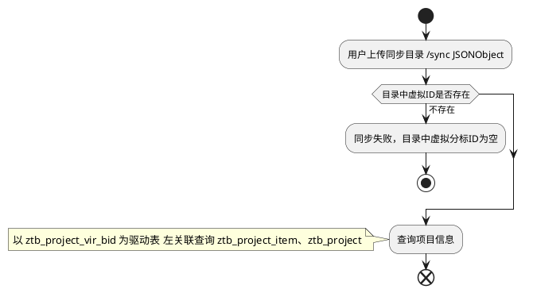
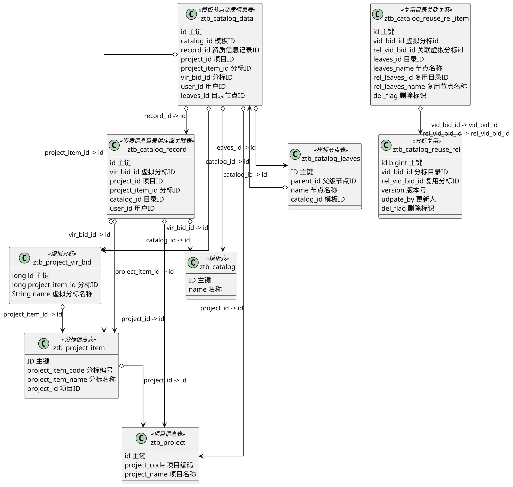

```plantuml
@startuml
start
:用户上传同步目录 /sync JSONObject;
if (目录中虚拟ID是否存在) is (不存在) then
   :同步失败，目录中虚拟分标ID为空;
   stop;
endif  
:查询项目信息;
note: 以 ztb_project_vir_bid 为驱动表 左关联查询 ztb_project_item、ztb_project 
end 
@enduml
```

```plantuml
@startuml
skinparam linetype ortho
skinparam dpi 300
class ztb_project_vir_bid  <<虚拟分标>>{
    long id 主键
    long project_item_id 分标ID
    String name 虚拟分标名称
}

class ztb_project_item <<分标信息表>>{
    ID 主键
    project_item_code 分标编号
    project_item_name 分标名称 
    project_id 项目ID
}

ztb_project_vir_bid o--> ztb_project_item : project_item_id -> id

class ztb_project <<项目信息表>> {
    id 主键
    project_code 项目编码
    project_name 项目名称
}
ztb_project_item o--> ztb_project : project_id -> id

class ztb_catalog_data <<模板节点资质信息表>> {
    id 主键
    catalog_id 模板ID
    record_id 资质信息记录ID
    project_id 项目ID
    project_item_id 分标ID
    vir_bid_id 分标ID
    user_id 用户ID
    leaves_id 目录节点ID
}

ztb_catalog_data o--> ztb_catalog : catalog_id -> id 
ztb_catalog_data o--> ztb_catalog_record : record_id -> id 
ztb_catalog_data o--> ztb_project : project_id -> id 
ztb_catalog_data o--> ztb_project_item: project_item_id -> id 
ztb_catalog_data o--> ztb_project_vir_bid : vir_bid_id -> id 
ztb_catalog_data o--> ztb_catalog_leaves: leaves_id -> id 


class ztb_catalog <<模板表>> {
    ID 主键
    name 名称
}

class ztb_catalog_leaves <<模板节点表>> {
    ID 主键
    parent_id 父级节点ID
    name 节点名称
    catalog_id 模板ID
}
ztb_catalog_leaves o--> ztb_catalog_data: catalog_id -> id 

class ztb_catalog_record <<资质信息目录供应商关联表>> {
    id 主键
    vir_bid_id 虚拟分标ID
    project_id 项目ID
    project_item_id 分标ID
    catalog_id 目录ID
    user_id 用户ID
}

ztb_catalog_record o--> ztb_project_vir_bid: vir_bid_id -> id 
ztb_catalog_record o--> ztb_project : project_id -> id 
ztb_catalog_record o--> ztb_project_item : project_item_id -> id
ztb_catalog_record o--> ztb_catalog : catalog_id -> id 

class ztb_catalog_reuse_rel  <<分标复用>>{
    id bigint 主键
    vid_bid_id 分标目录ID
    rel_vid_bid_id 复用分标ID
    version 版本号
    udpate_by 更新人
    del_flag 删除标识
}

class ztb_catalog_reuse_rel_item <<复用目录关联关系>> {
    id 主键
    vid_bid_id 虚拟分标id
    rel_vid_bid_id 关联虚拟分标id
    leaves_id 目录ID 
    leaves_name 节点名称
    rel_leaves_id 复用目录ID
    rel_leaves_name 复用节点名称
    del_flag 删除标识
} 

ztb_catalog_reuse_rel_item o--> ztb_catalog_reuse_rel : vid_bid_id -> vid_bid_id \n rel_vid_bid_id -> rel_vid_bid_id

@enduml
```