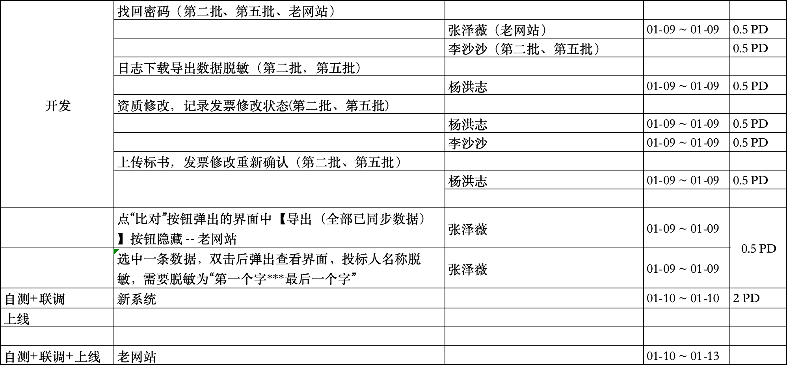
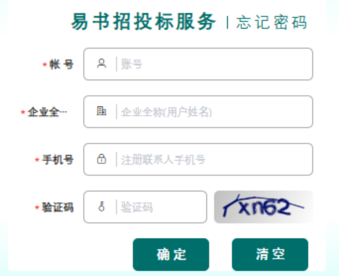
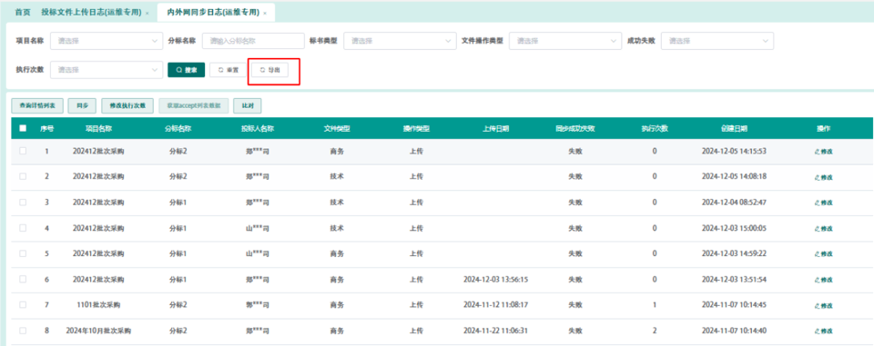

# 设计方案

# 项目排期


# 一. 背景与目标

## 背景
线上问题与功能优化

## 目标
需求预计实现的目标
1. 线上问题修复
2. 功能优化

## 收益
预期功能的收益

# 二. 需求分析

## 密码重置
修改忘记密码界面：忘记密码找回时，找回的密码不显示在前台，密码发送到注册的手机号码

- 第二批环境中开发
- 第五批环境中开发
- 老网站

### 测试用例

## 日志下载
投标文件上传日志（运维）、内外网同步日志（运维），两个菜单下载或导出的数据，供应商名称没有脱敏。
导出来的数据需要脱敏为“第一个字***最后一个字”


- 第二批环境中开发
- 第五批环境中开发

### 测试用例

## 资质信息修改
技术标：

增加记录资质信息是否有修改，如有修改则调保存接口，如没有修改不调用保存接口。当资质信息为发票时，发票信息有修改并保存后查验全部发票按钮显示气泡，点气泡提示“请查验所有发票”。点查验全部发票按钮后气泡去掉。
当资质信息为发票时，发票信息有修改并保存时，判断发票的确认状态，如果是已确认状态则修改为未确认状态。
- 第二批环境中开发
- 第五批环境中开发

## 标书上传前资质信息校验
技术标：

上传标书时，增加校验资质信息中的发票信息与发票表中的信息是否一致（排除删除状态的发票）。如果不一致，则提示“投标文件中发票信息与发票确认表中的数据不一致，请在标书制作界面重新点击查验全部发票”，并置发票确认状态为未确认，不允许上传。

- 第二批环境中开发
- 第五批环境中开发

### 测试用例

# 三. 系统架构设计

## 总体架构:
系统架构图

## 流程设计
功能的详细流程设计

### XXXX 功能设计
xxxx

#### XXXX功能 流程设计

#### XXXX功能 系统交互时序图
功能的系统流程调用时序设计

## 数据库设计

### ER图

### 建表语句


## 接口设计

### 用户登录接口

- URL：/api/v1/login

- 方法：POST

- 请求参数

    ```json
    {"username": "用户名", "password": "密码"}
    ```

- 返回值

    ```json
      {"status": "成功", "token": "JWT标识例"}
    ```

### 日志查询接口

- URL：/api/v1/logs

- 方法：GET

- 请求参数

    ```json
      {"start_date": "开始日期", "end_date": "结束日期"}
    ``` 

- 返回值

    ```json
      {"logs": ["日志列表"]}
    ```


