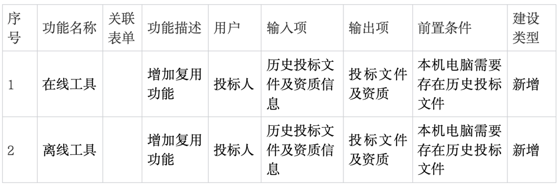
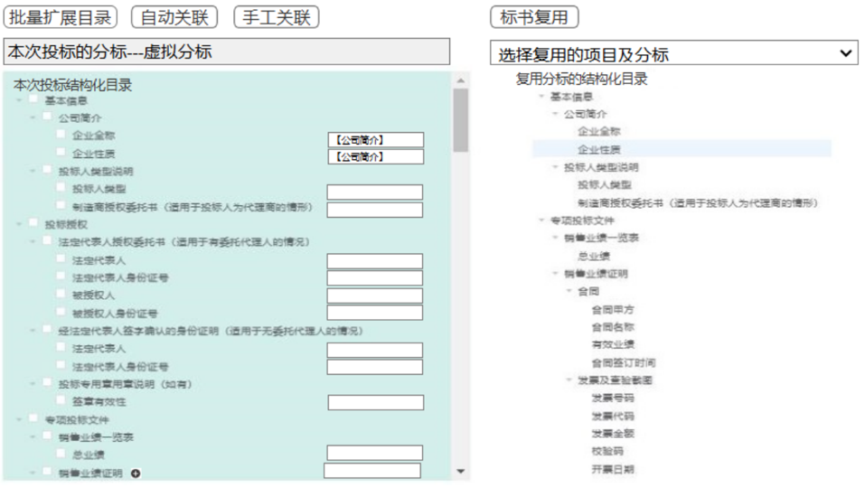

# 设计方案

# 一. 背景与目标

## 背景
优化用户体验，减少用户对相似标书的重复工作量

## 目标
投标人在客户端对应标书模板进行结构化填报及编制并添加相应佐证附件，标书制作完毕后可一键生成结构化制式应答文件，并提供标书预览、电子版加密等功能，结构化模块化标书制作提高投标文件编制规范性，同时保证电子版应答文件和纸质版应答文件的信息一致性，推动了无纸化单轨制评审应用。

## 收益
预期功能的收益

# 二. 需求分析

## 名词解释


## 标书复用
投标人可以引用历史的投标文件及资质信息，快速生成一版投标文件




### 获取用户可复用的项目及分标


功能描述

### 测试用例

# 三. 系统架构设计

## 总体架构:
系统架构图

## 流程设计
功能的详细流程设计

### XXXX 功能设计
xxxx

#### XXXX功能 流程设计

#### XXXX功能 系统交互时序图
功能的系统流程调用时序设计

## 数据库设计

### ER图

### 建表语句

用户表 (users)：记录用户基础信息，展示添加有效跨规则和选择型参数的提前小描述，及编码

## 接口设计

### 用户登录接口

- URL：/api/v1/login

- 方法：POST

- 请求参数

    ```json
    {"username": "用户名", "password": "密码"}
    ```

- 返回值

    ```json
      {"status": "成功", "token": "JWT标识例"}
    ```

### 日志查询接口

- URL：/api/v1/logs

- 方法：GET

- 请求参数

    ```json
      {"start_date": "开始日期", "end_date": "结束日期"}
    ``` 

- 返回值

    ```json
      {"logs": ["日志列表"]}
    ```


